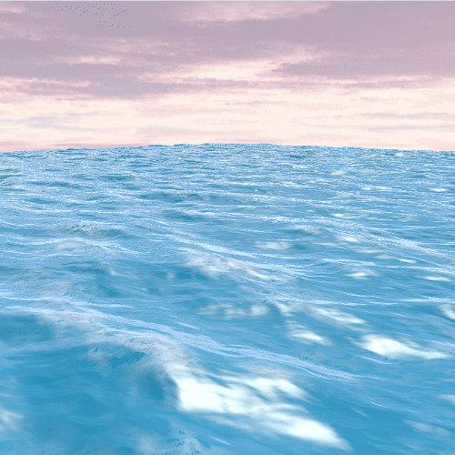
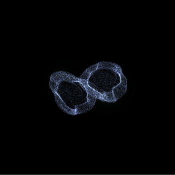
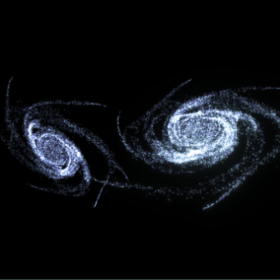

# Hey, I'm Majkejl

CS student with a focus on **graphics & GPU programming** — I like building things that run fast [1] and look cool [2].

1. Trust me bro et al., 2026
2. ↓

   
  
  
  

---

  More projects coming soon · Screenshots & GIFs will be added as projects finish

